# Team BuzzWare
<p align="center">
  
</p>

# csc-190-191-systemy
CSUS Senior Project by:

Thomas Kone - thomaskone@outlook.com

Xavier Umeda - 

Tuan Ton - tonthattuanst@gmail.com

Rachel Shindelus - rachelfshindelus@gmail.com

Shing Trinh - shingtrinh9201@gmail.com

Isaac Sclafani - isclafani@outlook.com

Serjeoh Nakata - serjeoh.nakata@gmail.com

# Introduction
Systemy is a full-stack business management platform built as a senior project for Sacramento State's CSC 190/191 capstone course. The application serves as an all-in-one CRM and operations hub, enabling businesses to manage clients, vendors, projects, leads, and invoices from a single dashboard. It features built-in analytics, activity tracking, automated reminders, email notifications, Gantt chart scheduling, audit logging, and automated lead scoring and recommendations — giving teams real-time visibility into their business relationships and workflows. BuzzWare was created to solve the problem of small businesses relying on disconnected tools for tracking leads, managing projects, and following up with clients. By consolidating these functions into one platform, BuzzWare reduces operational overhead and helps teams stay organized, responsive, and data-driven.

# Branching/Merging Strategy
The `main` branch is the parent branch, the most current version of the application resides here.

Branches should be created by a developer when they are assigned a specific ticket in Jira.

Branch name should be named `sys-#/description-of-card` and spun off of branch `main`.

When acceptance criteria of the card has been met and is ready for review, developer must open a Pull Request, targeting `main`.
The pull request must then be reviewed and approved by another developer if everything checks out. PR reviewer can also leave feedback or criticism as they wish.

This process ensures that developers can get more comfortable with all parts of the codebase as well and as operating as a basic QA proccess.

# Instructions to Run Project Locally
This repository contains both the frontend and backend source code for the project.

## Prerequisites
Ensure you have the following installed before running the project:
- **Node.js** v20.0.0 or newer
- **npm** v10.0.0 or newer

Download from https://nodejs.org if needed. Verify with:
```bash
node -v   # should show v20.x.x or newer
npm -v    # should show 10.x.x or newer
```

> **Note:** `npm install` will fail if your versions are too old — this is enforced via the `engines` field in `package.json`.


## To run the project
Clone the repository:
- git clone https://github.com/kone24/csc-190-191-systemy.git

Navigate to the root folder:
- cd csc-190-191-systemy

Install the backend and frontend dependencies
- npm run install:all	


## FRONTEND
Navigate to the frontend directory:
- cd frontend

Copy the env template and fill in your values:
- cp .env.example .env

Start the frontend dev server:
- npm run dev

View in browser:
- http://localhost:3000/

## BACKEND
Navigate to the backend directory:
- cd backend

Copy the env template and fill in your values:
- cp .env.example .env

Required env variables (see `.env.example` for the full list):
- `SUPABASE_URL` / `SUPABASE_ANON_KEY` — Supabase project credentials
- `CONTACT_FORM_SECRET` — shared secret for external contact form submissions

Start the backend:
- npm run start OR npm run start:dev
- Runs at http://localhost:3001/

# Testing

## Backend Tests
Navigate to the backend directory:
- cd backend

Run unit tests:
```bash
npm run test
```

Run unit tests in watch mode:
```bash
npm run test:watch
```

Run end-to-end tests:
```bash
npm run test:e2e
```

Run tests with coverage report:
```bash
npm run test:cov
```

## Frontend Tests
Navigate to the frontend directory:
- cd frontend

Run unit/component tests:
```bash
npm run test
```

Run tests in watch mode:
```bash
npm run test:watch
```

> **Note:** Backend tests use Jest and require a valid `.env` file. E2E tests spin up a full NestJS application instance. Frontend tests use Jest with React Testing Library.

# External Contact Form Integration
The CRM accepts contact form submissions from external client websites via `POST /clients/contact`, authenticated with a shared secret (`X-Api-Secret` header).

Currently integrated with:
- **lightfold.tv** (Squarespace) — Google Apps Script bridges form submissions from a Google Sheet to the CRM. See [`docs/squarespace-apps-script.js`](docs/squarespace-apps-script.js).
- **headword.co** (WordPress / Gravity Forms) — PHP snippet via WPCode plugin sends form data directly to the CRM. See [`docs/headword-gravity-forms-setup.md`](docs/headword-gravity-forms-setup.md).

# Synopsis of Our Project
Headword CRM is a full-stack client management platform with its purpose being to provide workers ease and efficiency in working with 
their clients. Providing a beautiful and functional dashboard page, including necessary and greatly beneficial analytics to efficiently 
track clients, interactions, deliverables, tagging, tasks, and internal workflow. 

# Testing Documents
<p>
  <a href="docs/Testing for Sprint2_Authentication and Verification_CSC190.pdf">
    📄 Sprint 02 – Auth & Verification Testing
  </a>
</p>

<p>
  <a href="docs/Testing For Sprint03- Search Bar and Filtered Search Results.pdf">
    📄 Sprint 03 – Search Bar & Filter Testing
  </a>
</p>

<p>
  <a href="docs/Sys-112-114-115-116 Testing.pdf">
    📄 Sprint 05 –  Logging In Testing
  </a>
</p>

<p>
  <a href="docs/Sprint05_sys-20-80-81-81_Testing.pdf">
    📄 Sprint 05 - Client Profile Description Testing
  </a>
</p>

<p>
  <a href="docs/Sys-28 Send Notification Testing.pdf">
    📄 Sprint 06 - Send Notifications Testing
  </a>
</p>

<p>
  <a href="docs/SYS-27_Schedule-Reminder_TESTING.pdf">
    📄 Sprint 07 - Scheduling a Reminder Testing
  </a>
</p>

<p>
  <a href="docs/SYS-57_Restrict-to-Company-Domain.pdf">
    📄 Sprint 07 - Restricting Access to Company Domain Testing
  </a>
</p>

<p>
  <a href="docs/_SYS-60_Find-User-Record_TESTING.pdf">
    📄 Sprint 07 - Find a User Record Testing
  </a>
</p>

<p>
  <a href="docs/SYS-142-Contacts-Backend_TESTING.pdf">
    📄 Sprint 07 - Backend for Contacts Testing
  </a>
</p>

<p>
  <a href="docs/SYS-27_Schedule-Reminder-Frontend_TESTING.pdf">
    📄 Sprint 08 - Scheduling a Reminder Testing
  </a>
</p>

<p>
  <a href="docs/TESTING_SYS-168_Sync-Company-Emails.pdf">
    📄 Sprint 09 - Enabling Email Notifications Testing
  </a>
</p>

<p>
  <a href="docs/System-Test-Report_BuzzWare.pdf">
    📄 SYSTEM TEST REPORT - Whole System Testing 
  </a>
</p>


# Product Screenshots
<p align="center">
  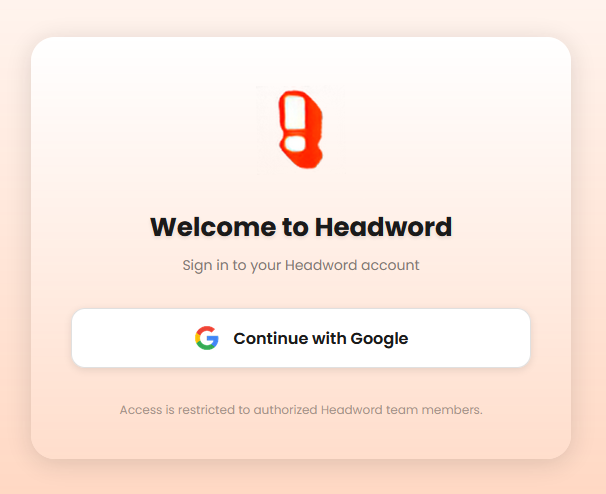
  <br />
  <em>Google Sign-On page for authorized Headword! members.</em>
</p>

<p align="center">
  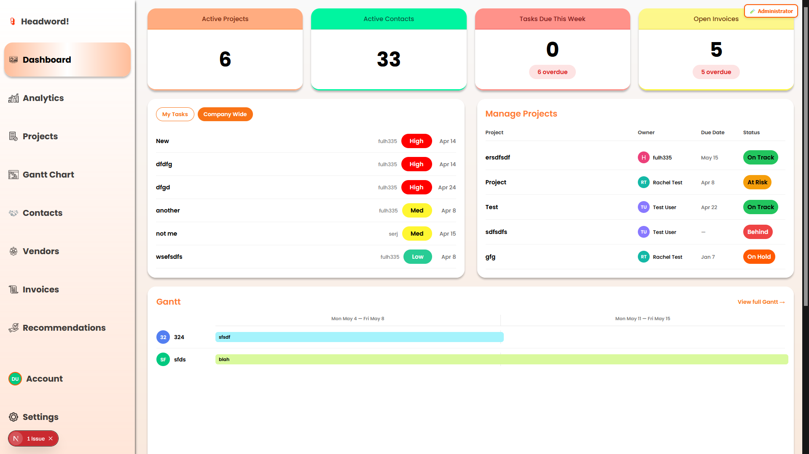
  <br />
  <em>Admin/manager dashboard showing business-wide metrics, active contacts, tasks, invoices, project summaries, and Gantt timeline data for a full operational overview.</em>
</p>

<p align="center">
  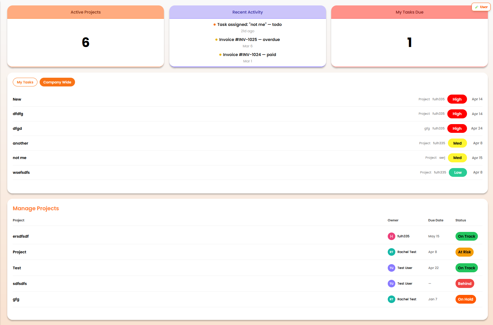
  <br />
  <em>User dashboard showing assigned tasks, recent activity, active projects, and project status information for standard Headword team members.</em>
</p>

<p align="center">
  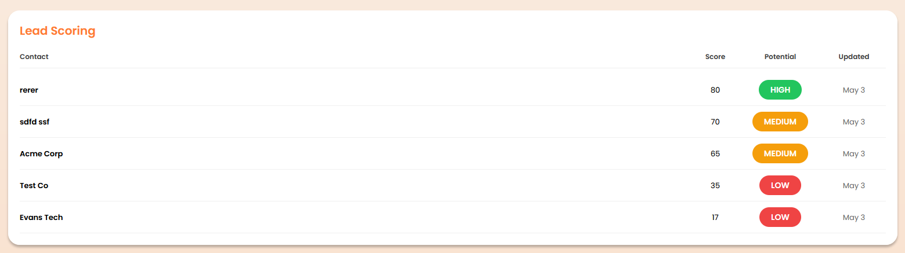
  <br />
  <em>Lead scoring dashboard panel that ranks contacts by potential using weighted CRM signals and displays their score, label, and last update date.</em>
</p>

<p align="center">
  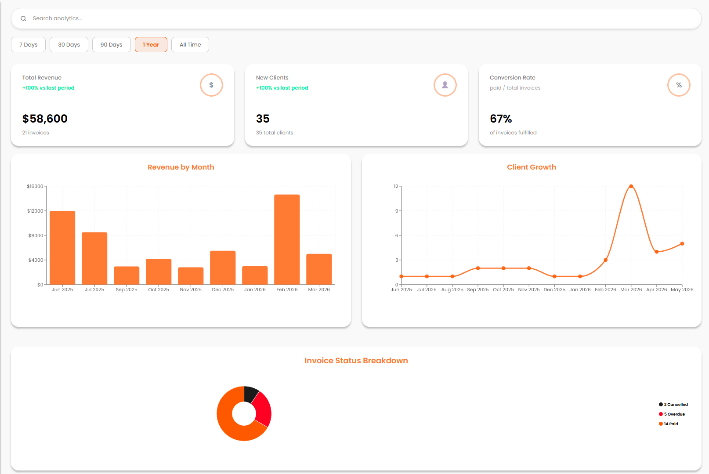
  <br />
  <em>Analytics page displaying revenue trends, client growth, invoice status, conversion rate, and date-range filters for tracking business performance.</em>
</p>

<p align="center">
  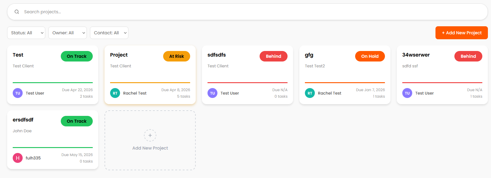
  <br />
  <em>Projects page for searching, filtering, creating, and tracking active client projects by owner, contact, due date, and status.</em>
</p>

<p align="center">
  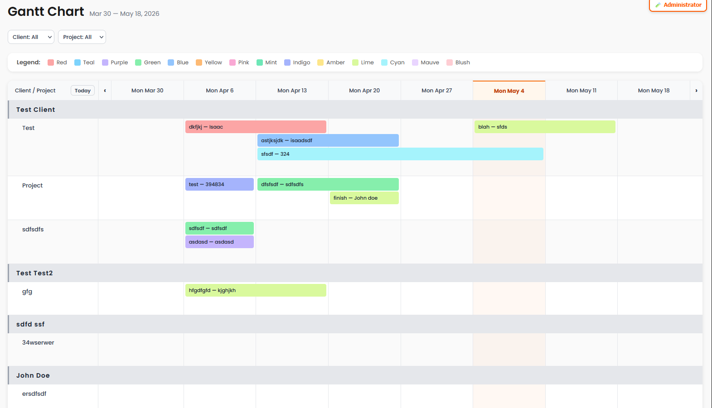
  <br />
  <em>Gantt chart page for visualizing project schedules, timelines, and task assignments across clients and projects.</em>
</p>

<p align="center">
  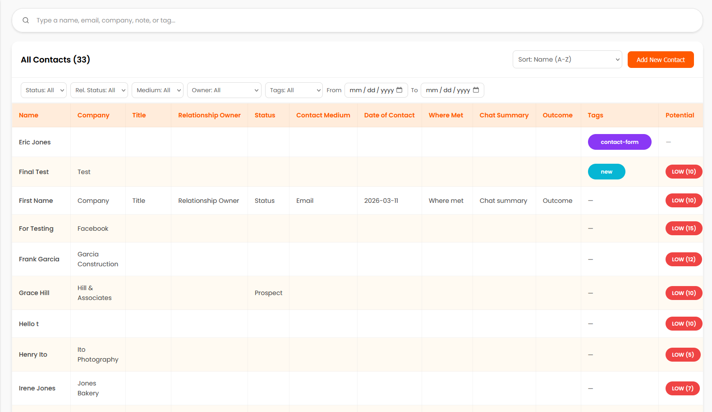
  <br />
  <em>Contacts page for managing client records, filtering contact data, and viewing each contact’s lead potential.</em>
</p>

<p align="center">
  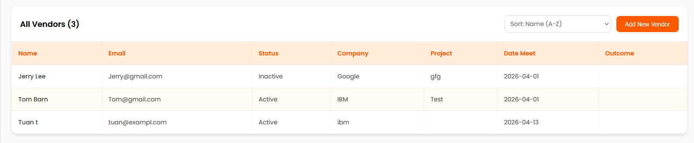
  <br />
  <em>Vendors page for viewing and managing vendor information, including company, status, project association, meeting date, and outcome.</em>
</p>

<p align="center">
  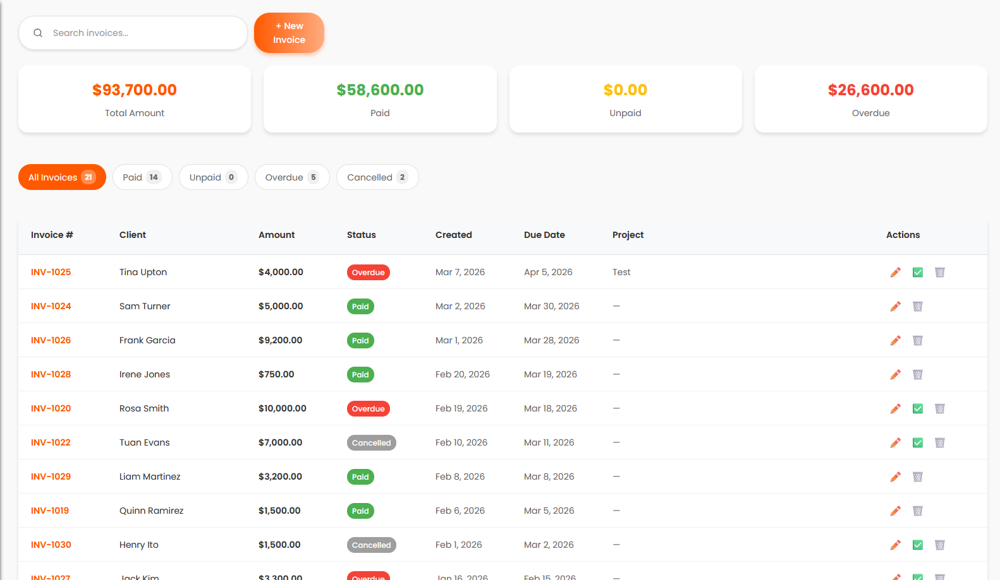
  <br />
  <em>Invoices page for tracking invoice totals, payment status, due dates, associated clients, and project billing information.</em>
</p>

<p align="center">
  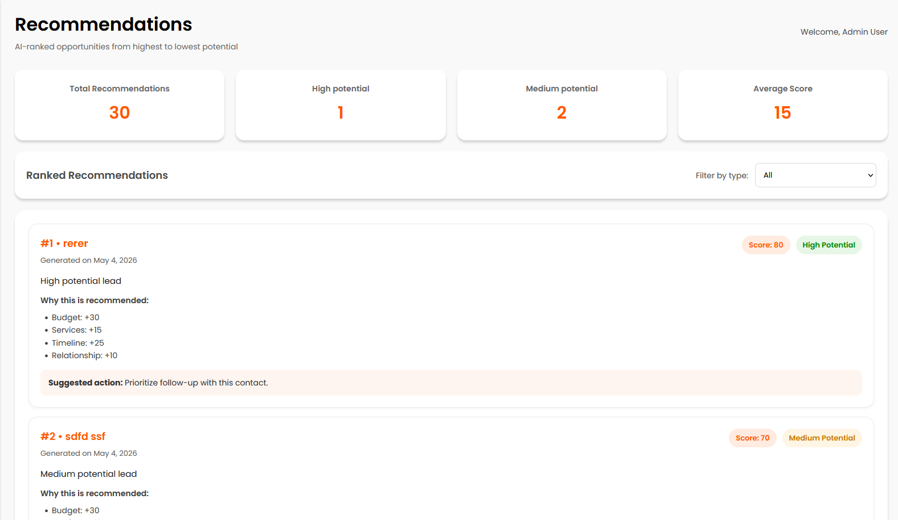
  <br />
  <em>Recommendations page that displays ranked business opportunities based on lead scoring results and suggested follow-up actions.</em>
</p>

<p align="center">
  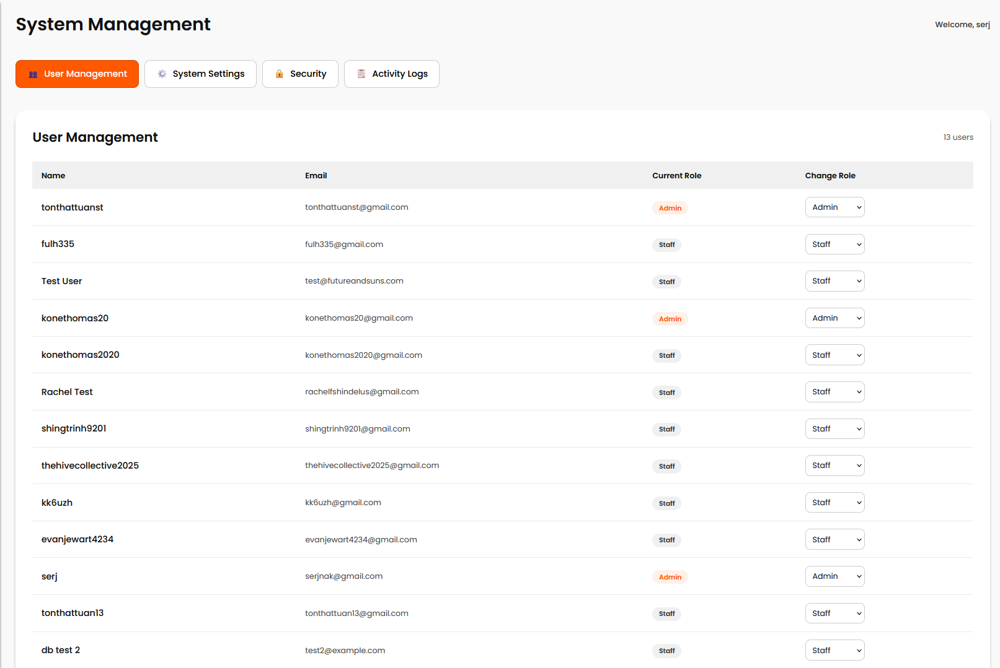
  <br />
  <em>User management page where administrators can view users and update account roles for access control.</em>
</p>

<p align="center">
  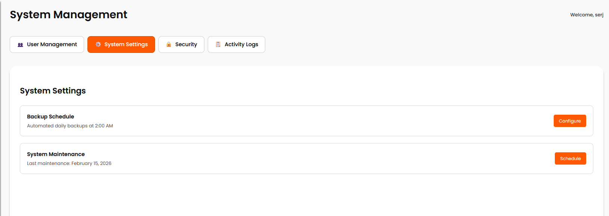
  <br />
  <em>System settings page for viewing and managing administrative maintenance options such as backups and scheduled maintenance.</em>
</p>

<p align="center">
  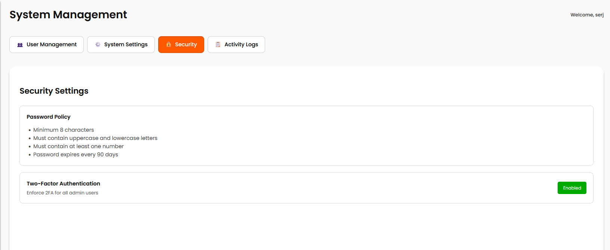
  <br />
  <em>Security page outlining password policy requirements and administrative security settings such as two-factor authentication.</em>
</p>

<p align="center">
  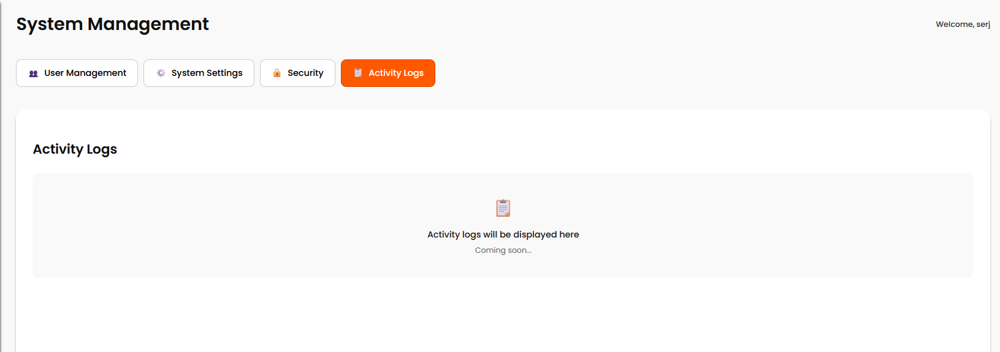
  <br />
  <em>Activity logs page intended for future administrative monitoring and audit history; this feature is currently a work in progress.</em>
</p>

<p align="center">
  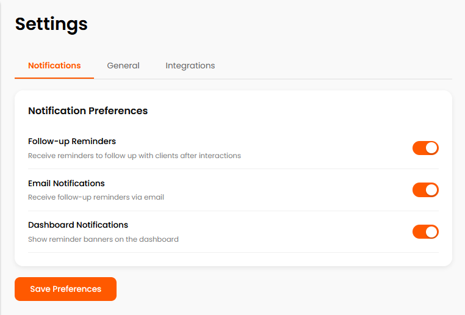
  <br />
  <em>Notification settings page where users can manage follow-up reminders, email notifications, and dashboard notification preferences.</em>
</p>

<p align="center">
  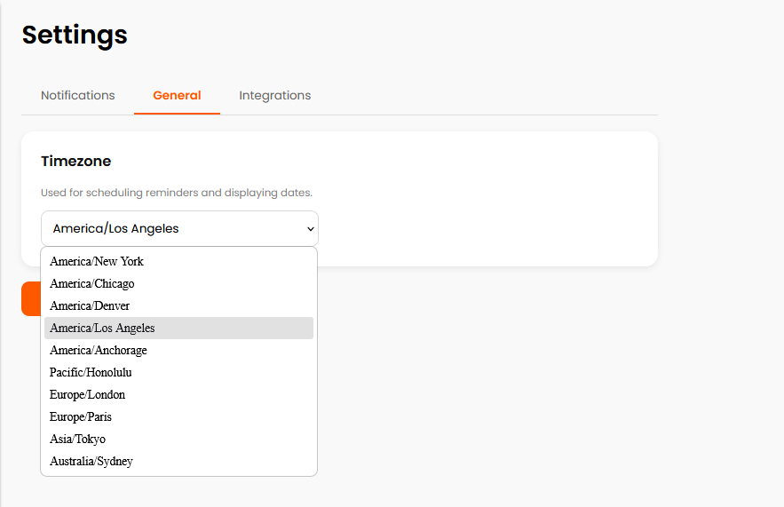
  <br />
  <em>General settings page where users can configure their timezone for reminders, scheduling, and date display.</em>
</p>

<p align="center">
  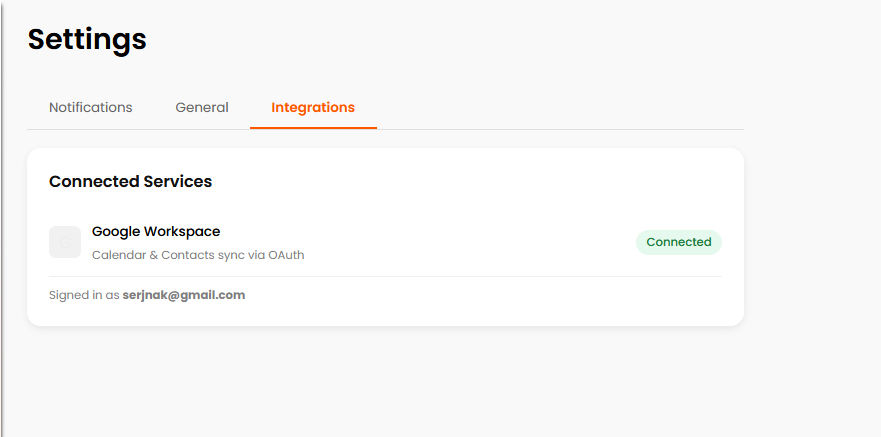
  <br />
  <em>Integrations settings page showing connected services such as Google Workspace for calendar and contacts sync.</em>
</p>

<p align="center">
  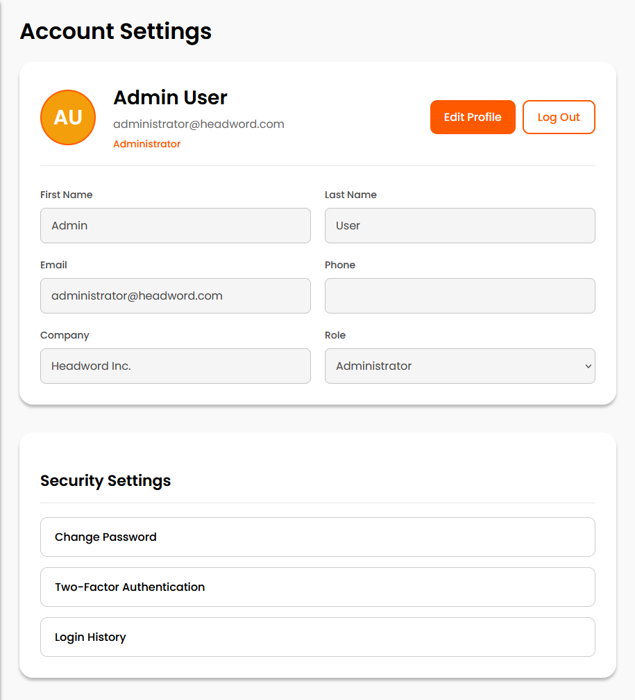
  <br />
  <em>Account settings page where users can view and edit profile details, role information, and security settings.</em>
</p>
